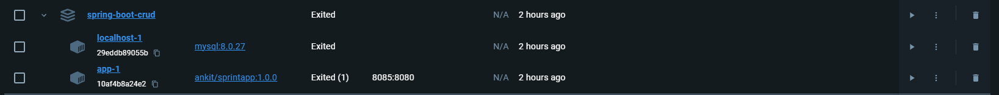

> Docker related things.

- Dockerfile: To host a single service.
  
<a href="Dockerfile Example">Dockerfile</a>

- docker-compose.yml: To bundle the group of services as a whole.

<a href="docker-compose Example.yml">docker-compose.yml file Example</a>
 </img>
